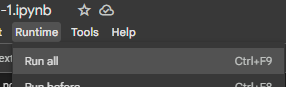
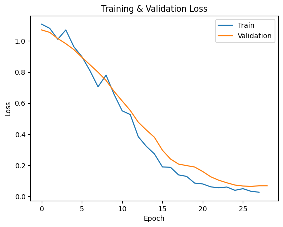
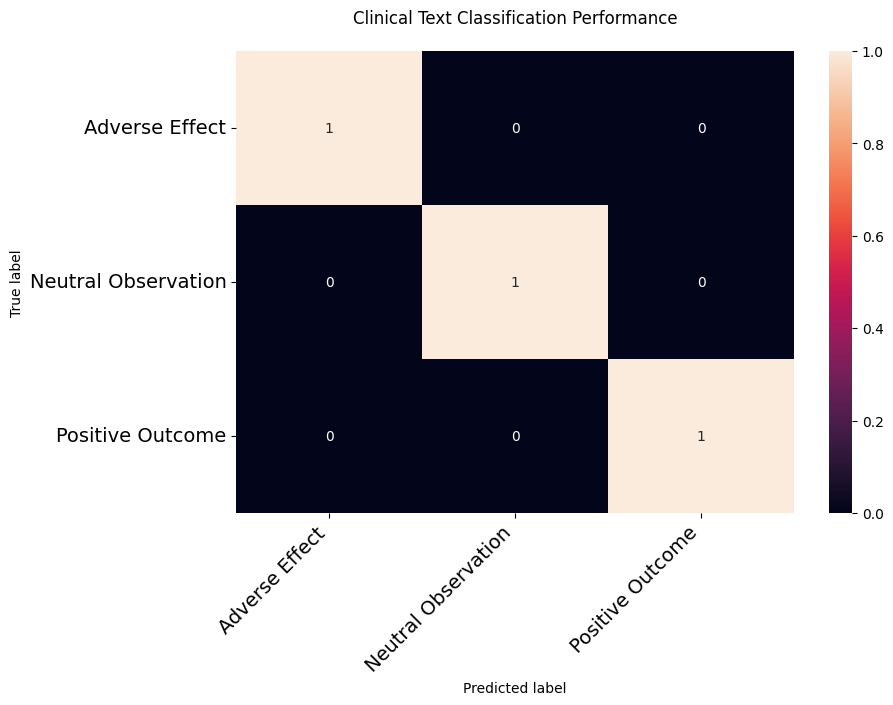
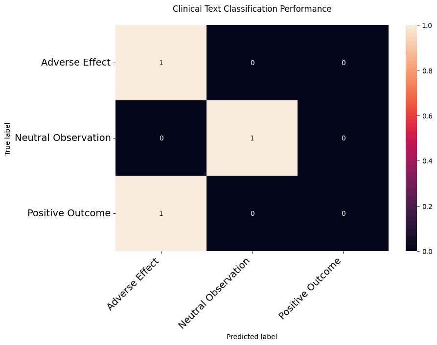

# Task 1: Sentence Classification

https://absorbing-action-f33.notion.site/Classification-NER-Model-1e3094bc1d758025b726ce8554651b3b

### Setup instructions

#### Google Colab

The instructions allow you to run the code on any device in your browser. Cell 2 provides specifications to allow you to run on your local CPU or GPU as sepcified in the [Requirements](https://absorbing-action-f33.notion.site/Classification-NER-Model-1e3094bc1d758025b726ce8554651b3b).

1. Download the notebook and upload to Google Drive. Open the notebook in Google Colab.
2. Upload `classification_data.csv` to the same location you uploaded the notebook
3. In cell 1, replace the `wandb_api_key` with your own wandb_api_key. You can create an account [here](https://wandb.auth0.com/login?state=hKFo2SBjUGhKeVlOOGZZb2FqYnpoYnpvNjZoV0Z3Mi1MWjVqdaFupWxvZ2luo3RpZNkgUHJxcmtOVTVmd0JpcFZka0pPbEhmLTNSZHRocF9GcXWjY2lk2SBWU001N1VDd1Q5d2JHU3hLdEVER1FISUtBQkhwcHpJdw&client=VSM57UCwT9wbGSxKtEDGQHIKABHppzIw&protocol=oauth2&nonce=al9iVVBiWi01X0U2V2ZmVg%3D%3D&redirect_uri=https%3A%2F%2Fapi.wandb.ai%2Foidc%2Fcallback&response_mode=form_post&response_type=id_token&scope=openid%20profile%20email)
4. In cell 3, update the `file_path_drive` with the location of your `classification_data.csv`
5. Click Runtime > Run all (Ctrl+F9)  
   

#### Local Windows

1. Run the following in your terminal as an Administrator if you don't have LongPathsEnabled

```
New-ItemProperty -Path "HKLM:\SYSTEM\CurrentControlSet\Control\FileSystem" -Name "LongPathsEnabled" -Value 1 -PropertyType DWORD -Force
```

2. Run `python -m pip install -r requirements.txt`
3. Run the notebook: `Aten_Classifier_v2_1.ipynb`

### Brief description of your approach

1. Foundation First: Started by getting the sample notebook to run. I prioritized a working baseline over immediate optimizations
2. Data-Centric Debugging: Identified and resolved duplicate entries that were causing validation contamination
3. Metrics-Driven Development: I built comprehensive evaluation tools (training and validation loss graphs, confusion matrix, accuracy, F1, etc.) before model tuning.
4. Progressive Complexity: Evolved from simple train-test splits to K-Fold, then Leave-one-out cross-validation (LOOCV) as needed.

The approach balanced practical execution with methodological rigor - focusing first on a functional implementation, then hyperparameter tuning based on model behavior observations.

### Training and evaluation guide

#### Hyperparameter Tuning Strategy

Batch Size Selection:

- Reduced from 16 → 2 → 1 after observing the small dataset size (n=15 after deduplication)
- Rationale: Smaller batches allow more frequent weight updates, crucial for learning from limited data
- Validation: Monitored loss curves for signs of instability

Epoch Configuration:

- Increased from 1 → 10 default epochs
- Further increased epochs from 10 → 50 since I implemented early stopping (patience=3)
- Rationale: Single epoch insufficient for convergence; early stopping prevents overfitting
- Diagnostic: Watched for when validation loss plateaued

Evaluation Frequency:

- Changed from epoch-based to step-based evaluation (eval_steps=1)
- Rationale: Needed finer-grained visibility into training dynamics. Reasonable approach since small dataset
- Impact: Revealed inconsistent loss patterns between runs

Learning Rate:

- Tested default (2e-5) vs reduced (1e-5)
- Finding: Default rate showed better loss convergence
- Evidence: 2e-5 produced smoother, more consistent descent curves

#### Validation Methodology

Phase 1: Initial Split

- 80-20 stratified split
- Issue Found: High variance in metrics (accuracy 66-100%)
- Resolution: Implemented K-Fold for more robust evaluation

Phase 2: K-Fold Validation

- Stratified 5-Fold (k=5 chosen for 3 samples per fold)
- Advantage: Maintained early stopping viability
- Finding: Significant fold-to-fold variability (some underfit, others optimal)
- Decided to scrap K-Fold Validation due to time constraint

#### Diagnostic Tools:

1. Loss Curve Analysis:

- Compared training vs validation curves
- Identified optimal stopping points

2. Metric Tracking:

- Custom metrics function tracking:

```python
def compute_metrics(pred):
    return {
        'accuracy': accuracy_score(...),
        'f1_macro': f1_score(..., average='macro'),
        'precision_macro': ...,
        'recall_macro': ...
    }
```

- Logged at each evaluation step
- Limitation: only 3 test cases, so the accuracy swung destrically between 66% (2/3 correctly classified) to 100% accuracy

3. Error Analysis:

- Identified consistent failure case:

```python
"Patient avoided severe complications..." → Misclassified as Adverse Effect
```

- Revealed model weakness with negated phrases

**Reproducibility Measures:**

- Noticed that the same notebook would produce differently results depending on the Colab session
- Asked DeepSeek (AI) to specify seeds for uncontrolled variables

**Training Arguments:**

```python
# 8a. Training Arguments
training_args = TrainingArguments(
    learning_rate=2e-5, # keep it default, potentially too high for small dataset
    per_device_train_batch_size=1, # 16 -> 1 because tiny dataset
    per_device_eval_batch_size=1,
    num_train_epochs=50,
    weight_decay=0.01,

    # logging_steps (training) and eval_steps (validation) should match so that graph aligns
    logging_steps=5, # small data, so use a low number to ensure graph is populated
    eval_steps=5,

    report_to="wandb",  # Explicitly tell it to use W&B
    run_name="helix-classification_v3_test",

    eval_strategy="steps", # small dataset, steps > epoch
    logging_strategy="steps",
    save_strategy="steps",

    load_best_model_at_end=True, # False -> True since early stopping implemented
    metric_for_best_model="eval_loss",  # What early stopping monitors, consider using f1
    greater_is_better=False  # Since we're tracking loss (lower=better)
)

early_stopping = EarlyStoppingCallback(
    early_stopping_patience=3,  # Stop after 3 evals without improvement: eval_step=5 * patience=3 = 15 steps of tolerance
    early_stopping_threshold=0.01  # Minimum change to qualify as improvement
)
```

### Results

- Evaluation metrics (accuracy, F1, precision, recall)





Best runs:

- Best validation accuracy: 100% (small test set, n=3, ~12 epochs)
- Best F1 : 100%

Typical Runs (running the same 'best run' book in different runtimes)

- Typical accuracy range: 66-100% (3 test cases, 1 missed)
- Typical F1 range: 56-100%

Key findings:

- Model struggles with negated phrases (e.g., "avoided severe complications")
- Performance highly dependent on data split due to small dataset size

### Examples

- Show model predictions on at least 5 example sentences

Text: Patient reported severe nausea after medication administration....
Prediction: Adverse Effect (confidence: 0.93)  
Class Probabilities:

- Adverse Effect: 0.926
- Neutral Observation: 0.031
- Positive Outcome: 0.043

Text: Blood pressure was measured at 120/80 mmHg....
Prediction: Neutral Observation (confidence: 0.74)  
Class Probabilities:

- Adverse Effect: 0.093
- Neutral Observation: 0.740
- Positive Outcome: 0.167

Text: Patient reported nausea after medication administration....
Prediction: Adverse Effect (confidence: 0.93)  
Class Probabilities:

- Adverse Effect: 0.927
- Neutral Observation: 0.031
- Positive Outcome: 0.042

Text: The treatment resulted in improvement of symptoms....
Prediction: Positive Outcome (confidence: 0.81)  
Class Probabilities:

- Adverse Effect: 0.129
- Neutral Observation: 0.065
- Positive Outcome: 0.806

**MISCLASSIFIED**

Text: Patient avoided severe complications after medication administration....
Prediction: Adverse Effect (confidence: 0.86)  
Class Probabilities:

- Adverse Effect: 0.863
- Neutral Observation: 0.050
- Positive Outcome: 0.087

### Future Improvements

1. Enhanced Validation Strategies

- Implement robust K-Fold cross-validation with proper stratification to get more reliable performance estimates
- Develop Leave-One-Out Cross Validation (LOOCV) pipeline specifically for small datasets
- Add Monte Carlo cross-validation for additional statistical reliability (`ShuffleSplit`, has higher bias, but less vraianec)

2. Advanced Data Handling

- Implement systematic data augmentation for:
  - Negated phrases ("no severe complications")
  - Synonym replacement (e.g., "headache" → "cephalalgia")
  - Back-translation
- AI generated examples

3. Model Architecture Improvements

- Experiment with domain-specific pretrained models:

  - BioClinicalBERT
  - BioMed-RoBERTa
  - SciBERT

- Implement attention mechanisms for better negation handling
  - ensures the classifier sees 'no severe' as a unit as opposed to just paying attention to the word 'severe'. Especially important since 'no adverse events reported' is a common phrase in journal articles.
  - The current classifier misclassified a positive outcome (Participants showed improved lung function after therapy with DrugC) as an adverse outcome, similar to what's seen in the examples
- Combine transformer outputs with traditional classifiers
  - Transformers may overcomplicate simpler problems
  - e.g., SVM, Naive Bayes



4. Training Optimization

- Implement learning rate scheduling (cosine decay)
- Add gradient accumulation for more stable small-batch training (only update weights after gradients from multiple batches)

1. Error Analysis & Debugging

- Build adverse test cases focusing on:
  - Negation
  - Ambiguous phrasing
  - Rare medical terms