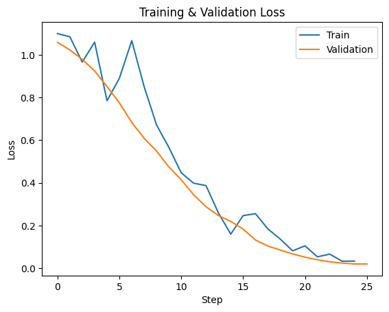

# Task 1: Sentence Classification

https://absorbing-action-f33.notion.site/Classification-NER-Model-1e3094bc1d758025b726ce8554651b3b

My plan was to first get the provided 'Sample NLP Modelling Notebook' to run. Then I added print statements for the required evaluation metrics and a function to show model proeudctions on at least 5 example sentences. I also generated a loss graph since this is usually how I evaluate model training at a glance. Once I have a running notebook with the standard metrics, I will begin tweaking the model.

I also made sure to document my process as I worked since I used DeepSeek a good amount and an 'LLM Usage Disclosure' is required. For transaprency, I wrote my proecss verbatim in a raw way, then I asked DeepSeek to clean it up to sound more professional and appropriate for a GitHub README.

Brief description of your approach

# Candid Workflow:

## 1. Get the 'Sample NLP Modelling Notebook' to run

My prirotiy is to get a notebook with a working model that I can tweak data and parameters with. My priority is to get the notebook working, at a section to test my model, add output for performance metrics.

THEN I would work on tweaking the classifier

1. Copy paste 'Sample NLP Modelling Notebook' from takehome prompt:
2. Setup Google colab notebook
3. Ensure I can import the data files and look at the head
4. Look at dataset, see if it's is balanced. I've done this before in a previous notebook, I copy pasted from there:

```
classification_df.head()
# check if dataset is balanced
label_counts = classification_df['label'].value_counts()
print("Class Distribution:")
print(label_counts)

"""
Adverse Effect         352
Neutral Observation    335
Positive Outcome       313
"""
```

- Looked balanced enough.
- I get a look at the data, I also look at the data after encoding and see that worse events are 0, better events are 2. Data is ordinally encoded which is intuitive.

5. Run the notebook as is, no changes, debug. For efficiency, I paste any errors into DeepSeek before looking too closely.

### Error 1: Deprecated args

```
# 8. Training Arguments
training_args = TrainingArguments(
    output_dir="/tmp/results", # default name of run on wandb.ai if run_name not specified
    eval_strategy="epoch",
```

- Within `training_args`, I changed `evaluation_strategy` -> `eval_strategy` bc of DeepSeek, confirmed with GitHub issues: https://github.com/huggingface/setfit/issues/512

### Error 2: wandb.ai

- seems I need an API key for [wandb.ai](https://wandb.ai/michellew-mcmaster-university/huggingface/runs/dttjcbf9?nw=nwusermichellew), so I make an account. I don't want to need to enter my API key everytime I run the notebook, so i ask deepseek how to set the API key
  Added API key and run name to `TrainingArguments`

```
os.environ['WANDB_API_KEY'] = wandb_api_key
...
training_args = TrainingArguments(
    ...
    report_to="wandb",  # Explicitly tell it to use W&B (rec from DeepSeek)
    run_name="helix-classification_v1"  # Custom run name, specificy v1 for using default notebook
)
```

6. I check the Deliverables: - **Examples**: Show model predictions on at least 5 example sentences
   I ask DeepSeek to write a predict function that will classify example sentences for my model. I give it the sample notebook code as context. I tweaked the code slightly and added my own sentences in addition to the 3 that DeepSeek generated:

```
# 12. Make predictions on sample text (DeepSeek generated)
def predict(text):
    inputs = tokenizer(text, return_tensors="pt", truncation=True, padding=True)
    with torch.no_grad():
        outputs = model(**inputs)
    logits = outputs.logits
    predicted_class = torch.argmax(logits, dim=1).item()
    return label_encoder.inverse_transform([predicted_class])[0]

# Test predictions
sample_texts = [
    "Patient reported severe nausea after medication administration.", # generated
    "Patient reported nausea after medication administration.", # removed word 'severe' to see how it performs
    "Patient avoided severe complications after medication administration.", # try 'AVOID SEVERE' together, misclassified
    "The treatment resulted in significant improvement of symptoms.", # generated
    "The treatment resulted in improvement of symptoms.", # removed word 'significant'
    "Blood pressure was measured at 120/80 mmHg." # generated
]

print("\nSample Predictions:")
for text in sample_texts:
    print(f"Text: {text}")
    print(f"Prediction: {predict(text)}\n")
```

It provides the following output:

```
Sample Predictions:
Text: Patient reported severe nausea after medication administration.
Prediction: Adverse Effect

Text: Patient reported nausea after medication administration.
Prediction: Adverse Effect

Text: Patient avoided severe complications after medication administration.
Prediction: Adverse Effect - MISCLASSIFIED

Text: The treatment resulted in significant improvement of symptoms.
Prediction: Positive Outcome

Text: The treatment resulted in improvement of symptoms.
Prediction: Positive Outcome

Text: Blood pressure was measured at 120/80 mmHg.
Prediction: Adverse Effect
```

The model seems to misclassify when there's a 'negative' (e.g., avoided severe -> classified as severe). This makes me want to add more data, or train on some less clean data. I'll revisit this later

7. I wanted to generate more metrics beyond the 1 line input of `print(metrics)`.

```
# 11. Evaluation
metrics = trainer.evaluate()
print(metrics)
```

I asked deepseek to help write the metrics out cleaner, but `eval_accuracy` did not exist when I tried the following code:

```
print("\nEvaluation Metrics:")
print(f"Validation Loss: {metrics['eval_loss']:.3f}")
print(f"Validation Accuracy: {metrics['eval_accuracy']:.3f}")
```

I gave it my error:

```
{'eval_loss': 0.19356654584407806, 'eval_runtime': 5.3324, 'eval_samples_per_second': 37.507, 'eval_steps_per_second': 2.438, 'epoch': 1.0}

Evaluation Metrics:
Validation Loss: 0.194
---------------------------------------------------------------------------
KeyError                                  Traceback (most recent call last)
<ipython-input-21-734473113> in <cell line: 0>()
     73 print("\nEvaluation Metrics:")
     74 print(f"Validation Loss: {metrics['eval_loss']:.3f}")
---> 75 print(f"Validation Accuracy: {metrics['eval_accuracy']:.3f}")

KeyError: 'eval_accuracy'
```

And it produced code for the `compute_metrics` parameter of:

```
trainer = Trainer(
    ...
    compute_metrics=compute_metrics # Added for metrics
)
```

I gave it my own code from previous notebooks and asked DeepSeek to adapt it for my notebook with the prompt:

```
I'm used to building my own model, not using someone elses. heres some work from another classifier i worked on:
from sklearn.metrics import classification_report, confusion_matrix
from sklearn.metrics import plot_confusion_matrix
from sklearn.metrics import accuracy_score

#  Attempt 10-fold cross validation
from sklearn.model_selection import cross_val_score # https://scikit-learn.org/stable/modules/generated/sklearn.model_selection.cross_val_score.html
from sklearn.model_selection import cross_validate
from sklearn.model_selection import KFold
# kf = KFold(n_splits=10) # Define the split - into 10 folds
from sklearn.model_selection import StratifiedKFold
# skf = StratifiedKFold(n_splits=10)

I want to do KFold validation. I also want accuracy score, f1, precision, recall and a confusion matrix
I also want a train validation accuracy and loss graphh, here is one i did before. Please try to use code thats easy to understand, or import someting that already gives me the graph, like having both train and testing on the same graph. Can I do this in both the notebook AND wandb.ai?

accuracy:
plt.plot(cnnhistory.history['categorical_accuracy'])
plt.plot(cnnhistory.history['val_categorical_accuracy'])
plt.title('model accuracy')
plt.ylabel('accuracy')
plt.xlabel('epoch')
plt.legend(['train', 'test'], loc='upper left')
plt.show()

loss:
# Plotting the Train Valid Loss Graph

plt.plot(cnnhistory.history['loss'])
plt.plot(cnnhistory.history['val_loss'])
plt.title('model loss')
plt.ylabel('loss')
plt.xlabel('epoch')
plt.legend(['train', 'test'], loc='upper left')
plt.show()

Please don't change anything about the model itself, I want to be able to assess the raw model, so I can see where I started, and then tweak LATER
```

It gave decent code, but I believe it over complicated the KFold validation, so I folowed up with the prompt:

```
Ok can you do this again but lets not use kfolds just yet, its making the code more confusing than it needs to be
```

It kept trying to change existing code and wrote some code I didn't think was necessary, but here's the code I used verbatim:

```
# Custom metrics function
def compute_metrics(pred):
    labels = pred.label_ids
    preds = pred.predictions.argmax(-1)
    return {
        'accuracy': accuracy_score(labels, preds),
        'f1_macro': f1_score(labels, preds, average='macro'),
        'precision_macro': precision_score(labels, preds, average='macro'),
        'recall_macro': recall_score(labels, preds, average='macro')
    }
...
# Trainer with metrics
trainer = Trainer(
    ...
    compute_metrics=compute_metrics
)
...
history = trainer.state.log_history

# Extract metrics for plotting
train_loss = [x['loss'] for x in history if 'loss' in x]
val_loss = [x['eval_loss'] for x in history if 'eval_loss' in x]
val_acc = [x['eval_accuracy'] for x in history if 'eval_accuracy' in x]
val_f1 = [x['eval_f1_macro'] for x in history if 'eval_f1_macro' in x]

# In-notebook plots
plt.figure(figsize=(15, 5))

# Loss plot
plt.plot(train_loss, label='Train')
plt.plot(val_loss, label='Validation')
plt.title('Training & Validation Loss')
plt.xlabel('Epoch')
plt.ylabel('Loss')
plt.legend()

plt.show()

# Final evaluation
predictions = trainer.predict(val_dataset)
preds = predictions.predictions.argmax(-1)

# Confusion Matrix
print("\nConfusion Matrix:")
print(confusion_matrix(val_labels, preds))

# Classification Report
print("\nClassification Report:")
print(classification_report(val_labels, preds, target_names=label_encoder.classes_))
```

`compute_metrics` was new to me so I asked it to explain it to me.

PROMPT:

```
Can you go slower and explain the compute_metrics function?

def compute_metrics(pred):
    labels = pred.label_ids
    preds = pred.predictions.argmax(-1)
    return {
        'accuracy': accuracy_score(labels, preds),
        'f1_macro': f1_score(labels, preds, average='macro'),
        'precision_macro': precision_score(labels, preds, average='macro'),
        'recall_macro': recall_score(labels, preds, average='macro')
    }

# 9. Trainer
trainer = Trainer(
    model=model,
    args=training_args,
    train_dataset=train_dataset,
    eval_dataset=val_dataset,
    compute_metrics=compute_metrics # Added for metrics
)
This is what Hugging Face says:
compute_metrics (Callable[[EvalPrediction], Dict], optional) — The function that will be used to compute metrics at evaluation. Must take a EvalPrediction and return a dictionary string to metric values. Note When passing TrainingArgs with batch_eval_metrics set to True, your compute_metrics function must take a boolean compute_result argument. This will be triggered after the last eval batch to signal that the function needs to calculate and return the global summary statistics rather than accumulating the batch-level statistics

class transformers.EvalPrediction
<
source
>
( predictions: typing.Union[numpy.ndarray, tuple[numpy.ndarray]]label_ids: typing.Union[numpy.ndarray, tuple[numpy.ndarray]]inputs: typing.Union[numpy.ndarray, tuple[numpy.ndarray], NoneType] = Nonelosses: typing.Union[numpy.ndarray, tuple[numpy.ndarray], NoneType] = None )

Parameters

predictions (np.ndarray) — Predictions of the model.
label_ids (np.ndarray) — Targets to be matched.
inputs (np.ndarray, optional) — Input data passed to the model.
losses (np.ndarray, optional) — Loss values computed during evaluation.
Evaluation output (always contains labels), to be used to compute metrics.
```

DeepSeek provided many examples to help me understand.

I also asked for help understanding the `predict` function since I used DeepSeek's code verbatim.

---

## 2. Evaluate the model as is -> Training and Evaluation Guide

Now that I have a notebook that outputs metrics and has a nice graph for seeing the training and validation loss, I can begin actually training the model.

The accuracy, precision, recall and f1-score are all 100%, which is suspeciious.
The training curve also shows a low validation loss from the start which leads me to believe the validation dataset likely has data that is also in the training set.


I visually check the data in `classification_data.csv` to confirm my suspeciousns quickly, and see 2 observations that are the same next to each other:

```
136	Severe allergic reactions were observed following DrugB administration.	Adverse Effect
137	Severe allergic reactions were observed following DrugB administration.	Adverse Effect
```

ASIDE: I realize that wandb.ai also has graphs, but I find the overlay of both training and validation loss important for quickly diagnosing the problem. While taking ML courses, I would usually refer to this great resource on diagnosing learning curves: https://rstudio-conf-2020.github.io/dl-keras-tf/notebooks/learning-curve-diagnostics.nb.html

My plan is to remove duplicate data, and check if the dataset is balanced again (if it's not, I'll consider making more data). Then ensure the train and validation test split is also balanced.

There are very few observations, but I will still train with this limited data.

```
Adverse Effect         5
Positive Outcome       5
Neutral Observation    5
```

TODO:
Small dataset tells me i should use Kfold Validation. I will implement this later.
For now, I'm just going to run the model on the small dataset.
The train validation loss graph was missing the training loss, so I updated the `TrainingArguments` to log more frequently.
I changed `epoch` -> `step` and ensured every step is logged. I looked into documentation (https://huggingface.co/docs/transformers/en/main_classes/trainer) and added the following:

```
# 8a. Training Arguments
training_args = TrainingArguments(
...
    eval_strategy="steps", .
    # changed from epoch -> steps since loss graph showed empty data for training loss, need both metrics calcualted at the same time.

    per_device_train_batch_size=2, # 16 -> 2 because tiny dataset
    per_device_eval_batch_size=2,

    num_train_epochs=10, # previously 1, too low, more realistic number of epochs.

    ...

    eval_steps=1,  # Evaluate every step
    logging_strategy="steps"
)
```

I decreased the batch size since the data set is very small, the longer training time is a small trade off. Also, since there are very few data points, I want the model to take its time learning to capture nuances in the data (as learnt from my ML professor). This way, my model will update weights after every sample.

I increased the number of epochs as well since 1 is way too low. I increased oto 10 for now and will likely continue to icnrease.

I will also implement early stopping since there are very few datapoints and the performance has been plateauing. Early stopping will also ensure trainng stops once validation loss stops improving.

I want the modle to evaluate every step so I set `eval_steps=1` and explicitly specified `logging_strategy="steps`

Since I have early stopping, I decided to increase the number of epochs even more.

I just keep tweaking. I added early stopping. It's doing better, but with such a small dataset, I fear it underfits or memorizes. I would try augmenting the data with more time. I would call this a milestone, duplicate the notebook and continue working.


I duplicated the [v2 notebook](https://colab.research.google.com/drive/1yXwbR8b_qnZoZE9AqjW0FvAfAGa3RfIg?usp=sharing), ran it again, and now training stops at epoch 8.75 instead of 11, validation loss jumped up, and I now have a 66% accuracy. Not sure what happened. I suspect the Colab environment is different in this new notebook since it's the exact same notebook. I felt it was about time I use K-Fold validation finally due to the variability of results.


## Version 3

implement k-fold cross validation?
I think Leave-one-out cross validation may be better for small datasets though. Computationally expensive though.

Leave-One-Out Cross-Validation (LOOCV)

- Usage: Both regression and classification
- Description: Each data point is used once as a test set, with the rest as training.
- When to use: Great for small datasets to maximize training data, though computationally intensive.
- SOURCE: https://www.datacamp.com/tutorial/k-fold-cross-validation
- good for n<30?

Standard K-Fold Cross-Validation

- Usage: Both regression and classification Splits the dataset into k equal-sized folds.
- Description:Each fold is used once as a test set.
- When to use: Best for balanced datasets to ensure comprehensive model evaluation.

Implemented K-Fold with great help from DeepSeek, but it would often hallucinate so I tweaked the code a lot to be less complicated. I wanted to be able to switch b/w kfold or LOOCV in the same notebook based on config at start.

Do Stratified k-folds bc first 2 folds are garbage, but 3rd fold is good


Learning rate too high?


Validation set not big enoug?

## Version 4 - LOOCV

I would reccomend using LOOCV, bu this would also mean I wouldn't employ early stopping since early stopping is based on validation metrics, and havig just 1 data point as the validation metric can lead to quite a bit of variability. I'll leave this as future implementation

# Version 5 - revisit version 2

- kept learning rate default since it gradually decreased showing that the learnig rate is fine. loss did not decrease as rapidly as an optimal curve, but it was decent enough.

From coursework, my loss is decreasing slowly but not extremely slowly, so I would just leave the learning rate (LR) as the deafult `2e-5`. The validation loss tracks the training loss fairly closely, and given the estimated time for this assignment, I won't go further. With more time, I may use an LR scheduler to find the optimal LR. For visualization, I would run multiple model while only changing the LR.


Also, recall that the accuracy went from 100% to 66%. This is expected since I only have 3 samples in the test set. All metrics should be taken with a grain of salt.

Here is the balanced test split taht achieved the graph above

```
Training data size: 12
Testing data size: 12
Training data : ['Increased liver enzymes were noted post-treatment with DrugA.', 'The study excluded patients with pre-existing conditions.', 'No significant side effects were observed during the trial.', 'The patient experienced nausea after taking DrugX.', 'Marked improvement in blood pressure control was achieved with DrugE.', 'Patients were instructed to maintain a food diary.', 'Severe allergic reactions were observed following DrugB administration.', 'Patients experienced enhanced mobility after using DrugD.', 'The treatment resulted in full remission for the majority of patients.', 'DrugZ caused severe rashes in some participants.', 'Data collection was completed over a six-month period.', 'Participants were monitored every two weeks.']
Testing data : [0, 1, 2, 0, 2, 1, 0, 2, 2, 0, 1, 1]
Training data size: 3
Testing data size: 3
Training data : ['Mild headaches were reported after the second dose of DrugY.', 'Participants showed improved lung function after therapy with DrugC.', 'Enrollment criteria included age and weight specifications.']
Testing data : [0, 2, 1]
```

Here is the data for the training and validation loss graph:

To better see the predictions, I asked DeepSeek to produce a more detailed prediction function. I have updated deliverable 4 to use DeepSeeks code verbatim:

```
# 12. Make predictions on sample text (DeepSeek generated)
def predict(text, model=final_model, return_probs=True):
    inputs = tokenizer(text, return_tensors="pt", truncation=True, padding=True)
    with torch.no_grad():
        outputs = model(**inputs)
    probs = torch.softmax(outputs.logits, dim=-1)
    pred_class = torch.argmax(probs).item()

    if return_probs:
        return {
            'prediction': label_encoder.inverse_transform([pred_class])[0],
            'confidence': probs.max().item(),
            'probabilities': {cls: prob.item() for cls, prob in zip(class_names, probs[0])}
        }
    return label_encoder.inverse_transform([pred_class])[0]
...
print("\n=== DETAILED PREDICTIONS ===")
for text in sample_texts:
    result = predict(text, model, return_probs=True)
    print(f"\nText: {text[:80]}...")
    print(f"Prediction: {result['prediction']} (confidence: {result['confidence']:.2f})")
    print("Class Probabilities:")
    for cls, prob in result['probabilities'].items():
        print(f"- {cls}: {prob:.3f}")
```

In the future, I will use leave-one-out cross-validation (LOOCV) instead of a fixed split.

For the final model, I trained it on all the dta (no test split), meaning that validation could not be ran. I also asked DeepSeek to produce this code.I tweaked the final_training_args using `replace` so that I wouldn't need to completely redefine the `training_args`:

```
# After evaluation, train on ALL data
final_model = DistilBertForSequenceClassification.from_pretrained(
    "distilbert-base-uncased",
    num_labels=len(class_names)
)

# Tokenize ALL data (no validation split)
full_encodings = tokenizer(classification_df['text'].tolist(), truncation=True, padding=True)
full_dataset = ClassificationDataset(full_encodings, classification_df['label_encoded'].tolist())


# For final full-data training: Disable evaluation
final_training_args = replace(
    training_args,
    eval_strategy="no",  # No validation during full training
    load_best_model_at_end=False,  # No validation = no "best" model
    report_to=None,
    output_dir="./final_model"  # Optional: Change save path
)

# Train on entire dataset
trainer_final = Trainer(
    model=final_model,
    args=final_training_args,
    train_dataset=full_dataset
)

trainer_final.train()
```


```
Confusion Matrix:
[[1 0 0]
 [0 1 0]
 [0 0 1]]

Classification Report:
                     precision    recall  f1-score   support

     Adverse Effect       1.00      1.00      1.00         1
Neutral Observation       1.00      1.00      1.00         1
   Positive Outcome       1.00      1.00      1.00         1

           accuracy                           1.00         3
          macro avg       1.00      1.00      1.00         3
       weighted avg       1.00      1.00      1.00         3
```

| Step | Training Loss | Validation Loss | Accuracy | F1 Macro | Precision Macro | Recall Macro |
| ---- | ------------- | --------------- | -------- | -------- | --------------- | ------------ |
| 5    | 1.1078        | 1.0708          | 0.3333   | 0.1667   | 0.1111          | 0.3333       |
| 10   | 1.0813        | 1.0552          | 0.3333   | 0.2222   | 0.1667          | 0.3333       |
| 15   | 1.0110        | 1.0157          | 0.6667   | 0.5556   | 0.5000          | 0.6667       |
| 20   | 1.0709        | 0.9825          | 0.6667   | 0.5556   | 0.5000          | 0.6667       |
| 25   | 0.9626        | 0.9443          | 0.6667   | 0.5556   | 0.5000          | 0.6667       |
| 30   | 0.8985        | 0.8948          | 0.6667   | 0.5556   | 0.5000          | 0.6667       |
| 35   | 0.8084        | 0.8469          | 0.6667   | 0.5556   | 0.5000          | 0.6667       |
| 40   | 0.7049        | 0.7987          | 0.6667   | 0.5556   | 0.5000          | 0.6667       |
| 45   | 0.7800        | 0.7459          | 0.6667   | 0.5556   | 0.5000          | 0.6667       |
| 50   | 0.6554        | 0.6751          | 0.6667   | 0.5556   | 0.5000          | 0.6667       |
| 55   | 0.5501        | 0.6134          | 1.0000   | 1.0000   | 1.0000          | 1.0000       |
| 60   | 0.5264        | 0.5526          | 1.0000   | 1.0000   | 1.0000          | 1.0000       |
| 65   | 0.3834        | 0.4769          | 1.0000   | 1.0000   | 1.0000          | 1.0000       |
| 70   | 0.3215        | 0.4267          | 1.0000   | 1.0000   | 1.0000          | 1.0000       |
| 75   | 0.2731        | 0.3800          | 1.0000   | 1.0000   | 1.0000          | 1.0000       |
| 80   | 0.1889        | 0.2964          | 1.0000   | 1.0000   | 1.0000          | 1.0000       |
| 85   | 0.1868        | 0.2399          | 1.0000   | 1.0000   | 1.0000          | 1.0000       |
| 90   | 0.1377        | 0.2074          | 1.0000   | 1.0000   | 1.0000          | 1.0000       |
| 95   | 0.1281        | 0.1975          | 1.0000   | 1.0000   | 1.0000          | 1.0000       |
| 100  | 0.0849        | 0.1884          | 1.0000   | 1.0000   | 1.0000          | 1.0000       |
| 105  | 0.0795        | 0.1596          | 1.0000   | 1.0000   | 1.0000          | 1.0000       |
| 110  | 0.0607        | 0.1255          | 1.0000   | 1.0000   | 1.0000          | 1.0000       |
| 115  | 0.0546        | 0.1032          | 1.0000   | 1.0000   | 1.0000          | 1.0000       |
| 120  | 0.0597        | 0.0869          | 1.0000   | 1.0000   | 1.0000          | 1.0000       |
| 125  | 0.0384        | 0.0724          | 1.0000   | 1.0000   | 1.0000          | 1.0000       |
| 130  | 0.0490        | 0.0661          | 1.0000   | 1.0000   | 1.0000          | 1.0000       |
| 135  | 0.0320        | 0.0639          | 1.0000   | 1.0000   | 1.0000          | 1.0000       |
| 140  | 0.0262        | 0.0674          | 1.0000   | 1.0000   | 1.0000          | 1.0000       |

Realistically, the accuracy is between 66% and 100%. This can be confirmed with Kfold validation with an optimal k=5 to ensure 3 test cases for each fold. This allows the early stopping mechanic to still be viable.

If using LOOCV, I would need to remove the early stopping and likely further tweak parameters (e.g., specify the number of epochs to ~10).

To ensure reproduceable results, I duplicated the notebook and ran it again.

The original notebook produced:

```
{'epoch': 11.666666666666666,
 'eval_accuracy': 1.0,
 'eval_f1_macro': 1.0,
 'eval_loss': 0.06743907183408737,
 'eval_precision_macro': 1.0,
 'eval_recall_macro': 1.0,
 'eval_runtime': 0.1876,
 'eval_samples_per_second': 15.99,
 'eval_steps_per_second': 15.99}
```

The duplicate produced:

```
{'epoch': 12.083333333333334,
'eval_accuracy': 1.0,
'eval_f1_macro': 1.0,
'eval_loss': 0.06819156557321548,
'eval_precision_macro': 1.0,
'eval_recall_macro': 1.0,
'eval_runtime': 0.1994,
'eval_samples_per_second': 15.043,
'eval_steps_per_second': 15.043}
```

I asked DeepSeek why there is a discrepency. I suspected something to do with the seed since only the train test split seed is set.

I added the following due to DeepSeeks advise:

```
import random
import numpy as np
import torch
import os

def set_seed(seed=42):
    """Set all random seeds for complete reproducibility"""
    random.seed(seed)          # Python's built-in random module
    np.random.seed(seed)      # NumPy's random number generator
    torch.manual_seed(seed)    # PyTorch's CPU random seed
    torch.cuda.manual_seed(seed)       # PyTorch's GPU random seed
    torch.cuda.manual_seed_all(seed)   # If using multi-GPU
    os.environ['PYTHONHASHSEED'] = str(seed)  # Python hash seed
    torch.backends.cudnn.deterministic = True  # CuDNN deterministic mode
    torch.backends.cudnn.benchmark = False     # Disable CuDNN autotuner

set_seed(42)  # Call this immediately after imports
```


This shows that I probably should have stuck with K-Fold validation to produce less variable results.

For fun, I decreased LR to `1e-5`

Looks similar to
.
Which makes sense beacuse the validation datastt is very small. I wil lstick with the previous LR.

Regaardless of the accuracy swing, it sill correctly classified my example sentences except the one with the 'negative' wording before the word 'adverse':
`"Patient avoided severe complications after medication administration."`

Unsure how to get consistent results:


But this is very close to a 'good' training and validation lost. This is when training the data on the full n=1000 results (including duplicates).

Since I've spent ~2 hours, I thought it was time to wrap up task 1. I asked DeepSeek to produce more code with the 'exmaple' section.

PROMPT:

```
Perfect, then how would I test with example sentences?
# 12. Make predictions on sample text (DeepSeek generated)
def predict(text):
    inputs = tokenizer(text, return_tensors="pt", truncation=True, padding=True)
    with torch.no_grad():
        outputs = model(**inputs)
    logits = outputs.logits
    predicted_class = torch.argmax(logits, dim=1).item()
    return label_encoder.inverse_transform([predicted_class])[0]

# Test predictions
sample_texts = [
    # AI generated examples
    "Patient reported severe nausea after medication administration.", # generated
    "The treatment resulted in significant improvement of symptoms.", # generated
    "Blood pressure was measured at 120/80 mmHg.", # generated

    # Modified AI generated examples
    "Patient reported nausea after medication administration.", # removed word 'severe' to see if it can still guess ADVERSE
    "Patient avoided severe complications after medication administration.", # try 'AVOID SEVERE' together, misclassified
    "The treatment resulted in improvement of symptoms.", # removed word 'significant'to see if it can still guess POSITIVE
]

print("\nSample Predictions:")
for text in sample_texts:
    print(f"Text: {text}")
    print(f"Prediction: {predict(text)}\n")
```

I used the produced code almost verbatim. DeepSeek gave me:

```
# ===== TESTING WITH EXAMPLE SENTENCES =====
print("\n=== FINAL MODEL TESTING ===")

# Option 1: Use the last trained model (simplest)
# final_model = model  # Uses model from last fold

# Option 2: Load best model from best fold (recommended)
best_fold = np.argmax([m['trainer_f1'] for m in fold_metrics])
print(f"\nUsing model from Fold {best_fold+1} (best validation F1)")

# Load the model (replace with your actual save/load logic)
final_model = DistilBertForSequenceClassification.from_pretrained(
    f"./results_kfold_fold_{best_fold}/checkpoint-best"
)

# Your existing predict function (slightly enhanced)
def predict(text, model=final_model, return_probs=False):
    inputs = tokenizer(text, return_tensors="pt", truncation=True, padding=True)
    with torch.no_grad():
        outputs = model(**inputs)
    probs = torch.softmax(outputs.logits, dim=-1)
    pred_class = torch.argmax(probs).item()

    if return_probs:
        return {
            'prediction': label_encoder.inverse_transform([pred_class])[0],
            'confidence': probs.max().item(),
            'probabilities': {cls: prob.item() for cls, prob in zip(class_names, probs[0])}
        }
    return label_encoder.inverse_transform([pred_class])[0]

# Test predictions with detailed output
sample_texts = [
    "Patient reported severe nausea after medication administration.",
    "The treatment resulted in significant improvement of symptoms.",
    "Blood pressure was measured at 120/80 mmHg.",
    "Patient reported nausea after medication administration.",
    "Patient avoided severe complications after medication administration.",
    "The treatment resulted in improvement of symptoms."
]

print("\n=== DETAILED PREDICTIONS ===")
for text in sample_texts:
    result = predict(text, return_probs=True)
    print(f"\nText: {text[:80]}...")
    print(f"Prediction: {result['prediction']} (confidence: {result['confidence']:.2f})")
    print("Class Probabilities:")
    for cls, prob in result['probabilities'].items():
        print(f"- {cls}: {prob:.3f}")
```

I tweaked it to be:

```
# 12. Make predictions on sample text (DeepSeek generated)
def predict(text, model=final_model, return_probs=True):
    inputs = tokenizer(text, return_tensors="pt", truncation=True, padding=True)
    with torch.no_grad():
        outputs = model(**inputs)
    probs = torch.softmax(outputs.logits, dim=-1)
    pred_class = torch.argmax(probs).item()

    if return_probs:
        return {
            'prediction': label_encoder.inverse_transform([pred_class])[0],
            'confidence': probs.max().item(),
            'probabilities': {cls: prob.item() for cls, prob in zip(class_names, probs[0])}
        }
    return label_encoder.inverse_transform([pred_class])[0]

# Test predictions
sample_texts = [
    # AI generated examples
    "Patient reported severe nausea after medication administration.", # generated
    "The treatment resulted in significant improvement of symptoms.", # generated
    "Blood pressure was measured at 120/80 mmHg.", # generated

    # Modified AI generated examples
    "Patient reported nausea after medication administration.", # removed word 'severe' to see if it can still guess ADVERSE
    "Patient avoided severe complications after medication administration.", # try 'AVOID SEVERE' together, misclassified
    "The treatment resulted in improvement of symptoms.", # removed word 'significant'to see if it can still guess POSITIVE
]

print("\n=== DETAILED PREDICTIONS ===")
for text in sample_texts:
    result = predict(text, model, return_probs=True)
    print(f"\nText: {text[:80]}...")
    print(f"Prediction: {result['prediction']} (confidence: {result['confidence']:.2f})")
    print("Class Probabilities:")
    for cls, prob in result['probabilities'].items():
        print(f"- {cls}: {prob:.3f}")
```
